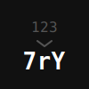

<p align="center">
  
</p>

<h1 align="center">@prsm/ids</h1>

Short, obfuscated, collision-proof, reversible identifiers.

## Installation

```bash
npm install @prsm/ids
```

## Usage

```js
import id from "@prsm/ids"

id.encode(12389125) // "7rYTs_"
id.decode("7rYTs_") // 12389125
```

## Configuration

Set custom alphabet:
```js
id.setAlphabet("GZwBHpfWybgQ5d_2mM-jh84K69tqYknx7LN3zvDrcSJVRPXsCFT")
```

Randomize alphabet:
```js
id.randomizeAlphabet()
```

## API

| Function              | Description                               |
|-----------------------|-------------------------------------------|
| `encode(num)`         | Converts number to obfuscated string      |
| `decode(str)`         | Converts obfuscated string back to number |
| `setAlphabet(str)`    | Sets custom alphabet for encoding         |
| `getAlphabet()`       | Returns current alphabet                  |
| `randomizeAlphabet()` | Shuffles alphabet characters randomly     |

## Notes

- Maximum encodable value: 2,147,483,647 (MAX_INT32)
- Changing alphabet changes encoded values
- Encoded values must be decoded with same alphabet

## License

Apache-2.0
